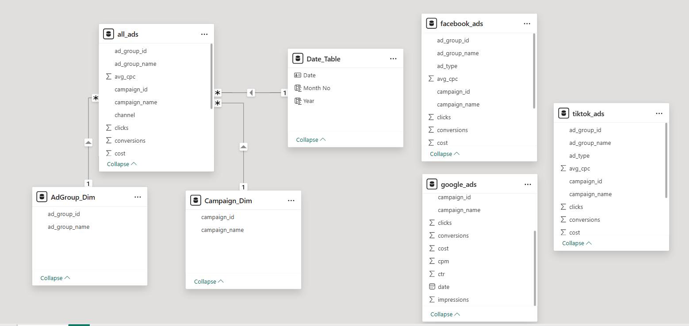

# marketing_anlaysis

1. Marketing Analysis Dashboard

https://app.powerbi.com/view?r=eyJrIjoiZjIxMmZmZmMtNWEyMy00ZmJlLTg5MjUtNmFlN2QyOGNkZDhmIiwidCI6ImYwZmVhNGY5LTc2OTctNDYzMy04YmE3LTRlMzRlNDdiMThhZSJ9

2. Snowflake .ipynb
 - **Improvado_Marketing_Analysis.ipynb**: General validation and addition of calculated columns
 - **Create_All_Ads_Table.ipynb.ipynb**: Create consolidated table for all channels

3. Power BI Data Model
 - 